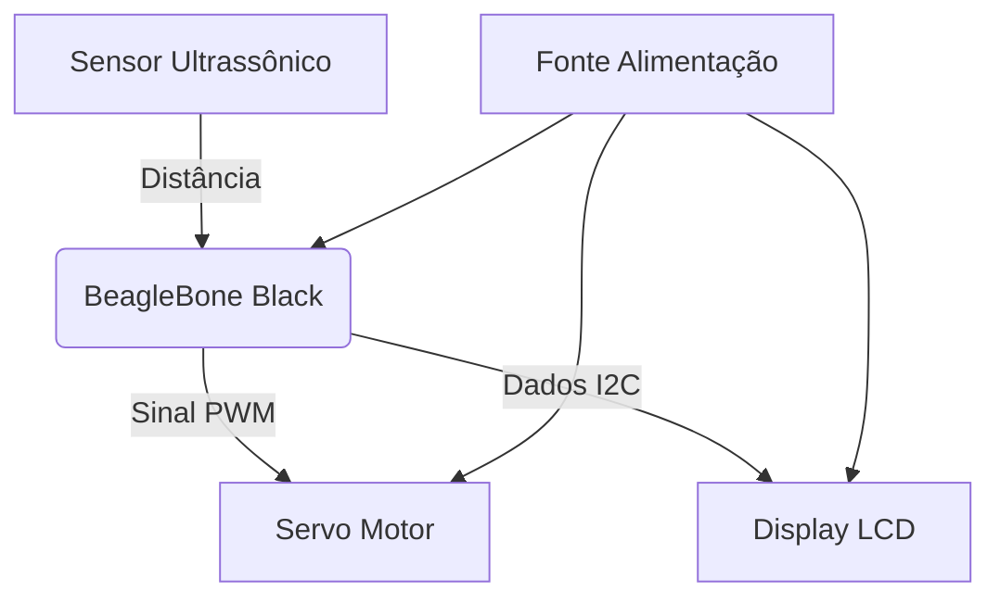

# Projeto Final - Técnicas de Programação para Sistemas Embarcados 2

## Introdução
Este repositório contém o desenvolvimento do projeto final da disciplina de Técnicas de Programação para Sistemas Embarcados 2 (TPSE2). O trabalho consiste na implementação de uma lixeira automática inteligente, utilizando sistemas embarcados para automação residencial e corporativa.

## Objetivos do Projeto
O projeto tem como principais objetivos:

1. **Facilitar o descarte de resíduos** no cotidiano doméstico
2. **Otimizar processos** em ambientes corporativos
3. **Reduzir o contato físico** com a lixeira, promovendo higiene
4. **Implementar soluções IoT** básicas utilizando sistemas embarcados
5. **Desenvolver competências** em programação para hardware específico

## Materiais e Componentes
A implementação do protótipo utilizou os seguintes componentes:

| Componente | Especificações | Função no Projeto |
|------------|----------------|-------------------|
| BeagleBone Black | Processador AM335x 1GHz, 512MB RAM | Unidade de processamento principal |
| Sensor Ultrassônico HC-SR04 | Alcance 2cm-4m, precisão 3mm | Detecção de presença e medição de distância |
| Servo Motor SG90 | Torque: 1.8kgf·cm, alimentação 4.8V-6V | Mecanismo de abertura/fechamento da tampa |
| Display LCD 16x2 com módulo I2C | Endereço 0x27, tensão 5V | Interface de visualização de status |
| Fonte de alimentação | 5V 2A | Fornecimento de energia ao sistema |

## Metodologia de Desenvolvimento
O projeto foi desenvolvido em etapas incrementais:

### 1. Configuração Inicial do Ambiente
- Setup do SO na BeagleBone Black
- Configuração de GPIOs e interfaces de comunicação
- Testes básicos de I/O digital

### 2. Implementação dos Subsistemas
**2.1 Controle do Servo Motor**
- Calibração dos ângulos de abertura/fechamento
- Implementação de PWM para controle de posição
- Testes de resposta temporal

**2.2 Integração do Sensor HC-SR04**
- Desenvolvimento do algoritmo de medição por tempo de eco
- Filtragem de ruído para leituras consistentes
- Definição do limiar de ativação (30cm)

**2.3 Interface com Display LCD**
- Configuração do barramento I2C
- Implementação de biblioteca para comunicação
- Definição dos elementos de UI:
  - Status da lixeira (aberta/fechada)
  - Contador de acionamentos
  - Mensagens de erro quando aplicável

### 3. Integração e Testes
- Sincronização dos subsistemas
- Validação dos tempos de resposta
- Testes de usabilidade com cenários reais
- Ajustes finos de sensibilidade

## Arquitetura do Sistema

### Agradecimentos  
Este projeto foi desenvolvido pelos alunos do curso de Engenharia de Computação da Universidade Federal do Ceará - Campus Quixadá composto por:  

- **Nathalia de Oliveira Lima** (Graduanda em Engenharia da Computação)  
- **Marcos da Silva Nascimento** (@Mark-EC-2023)  

sob orientação do Prof. Dr. Francisco Helder Cândido dos Santos Filho.
